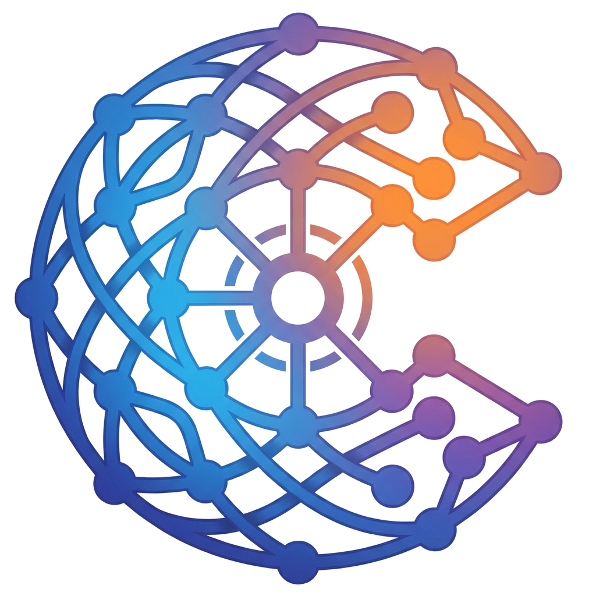
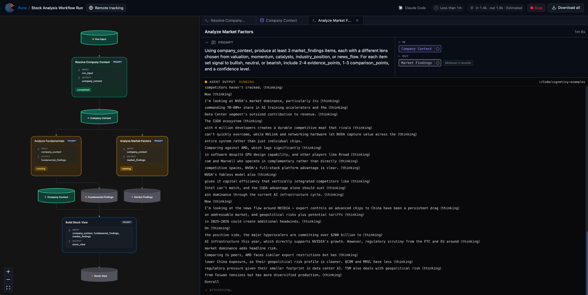

<p align="center">
  
</p>

# Cognetivy 2.0

[](https://www.npmjs.com/package/cognetivy)
[](https://github.com/meitarbe/cognetivy/stargazers)

**Website:** [cognetivy.com](https://cognetivy.com)



**Reasoning orchestration for agents:** durable **workflows**, **runs**, **events**, and **collections** - with a **local studio** (browser UI + executor) and **cloud** sync when you sign in.

---

## Star history

<a href="https://star-history.com/#meitarbe/cognetivy&Date">
  <picture>
    <source media="(prefers-color-scheme: dark)" srcset="https://api.star-history.com/chart?repos=meitarbe/cognetivy&type=date&theme=dark&legend=top-left" />
    <source media="(prefers-color-scheme: light)" srcset="https://api.star-history.com/chart?repos=meitarbe/cognetivy&type=date&legend=top-left" />
    
  </picture>
</a>

---

## Why Cognetivy

AI coding agents are great at producing output, but their process is usually hard to inspect and hard to repeat.

Cognetivy gives your agent an operational layer so you can:

- **Define how it should work** with explicit workflows
- **Track what happened** in each run and event
- **Keep reasoning artifacts organized** in structured collections
- **Re-run and compare outcomes** with a persistent local workspace

In short: Cognetivy turns powerful-but-chaotic agent sessions into structured, auditable workflows.

---

## Explain it like I'm new to this

Think of your coding agent as a very smart intern:

- **The model** is the brain
- **Your editor** is the workspace
- **Cognetivy** is the memory + process manager

Without Cognetivy, a lot of important context lives in chat history and disappears. With Cognetivy, that work is captured as workflows, runs, events, and collections.

---

## Great for

- Building repeatable, local AI coding workflows
- Running structured research tasks with coding agents
- Teams that need traceability and auditability for their local agent output

---

## What you actually do with the product

**Onboarding.** Install the CLI, then run `cognetivy` from a project folder. If you are not signed in yet, the CLI opens the app (or local studio) so you can authorize once; your API key is stored on your machine. A minimal workspace appears under `.cognetivy/` so state stays next to your repo.

**Local studio (default).** With no subcommand, Cognetivy starts the local studio: a small server (HTTP + WebSocket), the bundled UI in your browser, and the **executor** that advances runs and nodes on your machine. You design and inspect workflows visually, see runs, and drive execution without losing the thread in chat alone.

**Creating and evolving workflows.** Pick a **template**, **apply** it to your cloud workflow, or shape a graph in the studio. You can browse built-in templates (`workflow templates`), materialize one, and iterate on versions. The CLI and UI stay in sync with the same workflow index and cloud workflow when you use `cognetivy auth login` or `COGNETIVY_API_KEY`.

---

## Requirements

- **Node.js** ≥ 18
- **`better-sqlite3`** is bundled as a dependency (native builds / prebuilds apply as for any project using it).

---

## Install

Run once with one command:

```bash
npx cognetivy
```

Or install globally for use from any directory:

```bash
npm install -g cognetivy

cognetivy
```

---

## Quick reference

| Command | Purpose |
|--------|---------|
| `cognetivy` | Start local studio (and guided sign-in on first interactive use if needed). |
| `cognetivy auth login` / `auth status` | Cloud API key and resolved URLs. |
| `cognetivy docs` | Open CLI documentation in the browser. |
| `cognetivy workflow …` | List, create, get, templates, apply-template, set current workflow, … |
| `cognetivy run …` | Start and advance runs, status, step. |

Use **`cognetivy --help`** for the full tree.

---

## Programmatic API

The package exposes a **TypeScript/JavaScript** API (see `main` in `package.json`): workspace helpers, models, config, validation, and related utilities. The CLI binary is `cognetivy`.

```ts
import { /* workspace, models, … */ } from "cognetivy";
```

The **`@cognetivy/core`** package in the repository is built and synced into this package for release; npm consumers typically install **`cognetivy`** only.


---

## License

MIT - see `LICENSE` in the repository.
